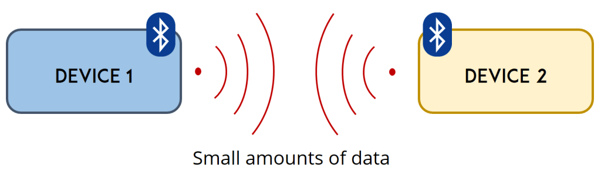
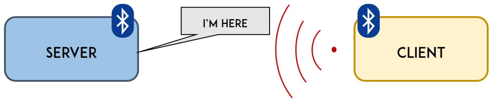

# Communications
## Bluetooth
| | Description | Code | Docs |
|-|:------------|:----:|:----:|
|[Scanner](/communications/bluetooth/scan) |How to scan the bluetooth space area? |[:x:](/communications/bluetooth/scan/scan.ino)|[:x:](/communications/bluetooth/README.md)|
|[Server](/communications/bluetooth/server) |How to build a bluetooth server? |[:x:](/communications/bluetooth/server/server.ino)|[:x:](/communications/bluetooth/README.md)|
|[Client](/communications/bluetooth/client) |How to connect to a bluetooth as a client? |[:x:](/communications/bluetooth/client/client.ino)|[:x:](/communications/bluetooth/README.md)|

[[Go back]](/communications)

### What is Bluetooth Low Energy?
Bluetooth Low Energy, BLE for short, is a power-conserving variant of Bluetooth. BLE’s primary application is short distance transmission of small amounts of data (low bandwidth). Unlike Bluetooth that is always on, BLE remains in sleep mode constantly except for when a connection is initiated.
This makes it consume very low power. BLE consumes approximately 100x less power than Bluetooth (depending on the use case).

With Bluetooth Low Energy, there are two types of devices: the server and the client. The ESP32 can act either as a client or as a server.
The server advertises its existence, so it can be found by other devices, and contains the data that the client can read. The client scans the nearby devices, and when it finds the server it is looking for, it establishes a connection and listens for incoming data. This is called point-to-point communication.

