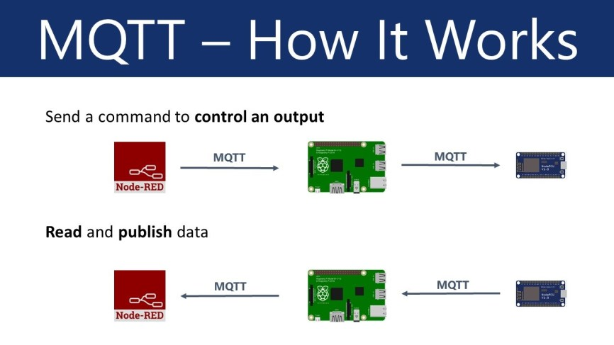
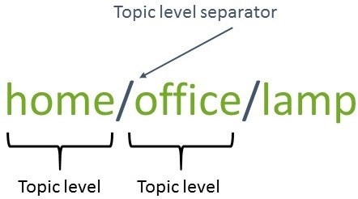
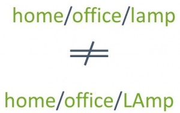
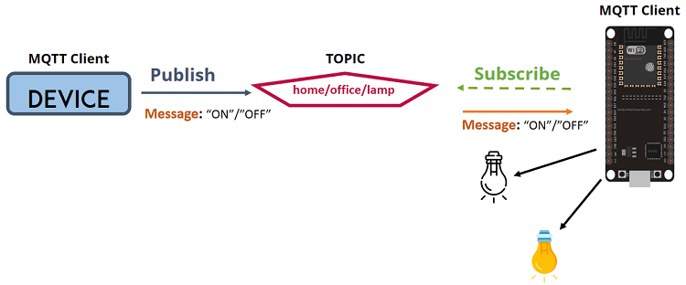
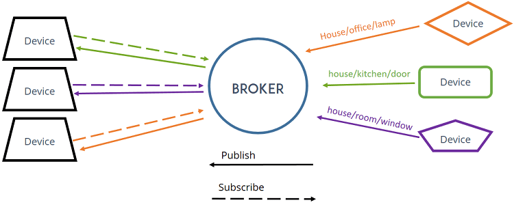
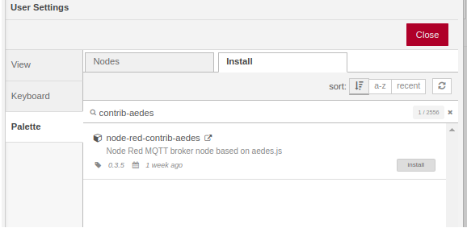
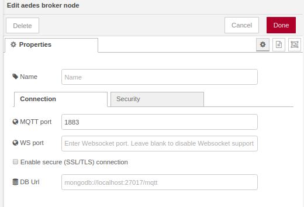

# Communications
## MQTT
What is MQTT?

MQTT is a simple messaging protocol, designed for constrained devices with low-bandwidth. So, it’s the perfect solution for Internet of Things applications. MQTT allows you to send commands to control outputs, read and publish data from sensor nodes and much more.

It is a lightweight publish and subscribe system where you can publish and receive messages as a client.
Therefore, it makes it really easy to establish a communication between multiple devices.

### Basic concepts
In MQTT there are a few basic concepts that you need to understand:

- Publish/Subscribe
- Messages
- Topics
- Broker

### Publish/Subscribe
The first concept is the publish and subscribe system. In a publish and subscribe system, a device can publish a message on a topic, or it can be subscribed to a particular topic to receive messages

- For example Device 1 publishes on a topic.
- Device 2 is subscribed to the same topic as device 1 is publishing in.
- So, device 2 receives the message.

### Messages
Messages are the information that you want to exchange between your devices. Whether it’s a command or data.

### Topics
Another important concept are the topics. Topics are the way you register interest for incoming messages or how you specify where you want to publish the message.

Topics are represented with strings separated by a forward slash. Each forward slash indicates a topic level. Here’s an example on how you would create a topic for a lamp in your home office:

Note: topics are case-sensitive, which makes these two topics different:

If you would like to turn on a lamp in your home office using MQTT you can imagine the following scenario:

- You have a device that publishes “on” and “off” messages on the home/office/lamp topic.
- You have a device that controls a lamp (it can be an ESP32, ESP8266, or any other board). The ESP32 that controls your lamp, is subscribed to that topic: home/office/lamp.
- So, when a new message is published on that topic, the ESP32 receives the “on” or “off” message and turns the lamp on or off.

### Broker

The broker is primarily responsible for receiving all messages, filtering the messages, decide who is interested in them and then publishing the message to all subscribed clients.

There are several brokers you can use, but one easy way to do it is by using the aedes mqtt broker (Node-Red) for both Publish and Subscribe:

- [Aedes Broker](https://flows.nodered.org/node/node-red-contrib-aedes)

To install this broker node in Node-Red: 
  1. Search "contrib-aedes" in the Manage Palette
  
  
  
  2. Click install
  
  3. Choose the port for the MQTT communication (default: 1883)
  
  
  
  * the broker IP will be the IP of he device where the Node-Red is running

## Our implementation
We will divide this functionality into: 
  1. [Publish](publish/README.md) 
  2. [Subscribe](subscribe/README.md)

[[Go back]](/communications)
