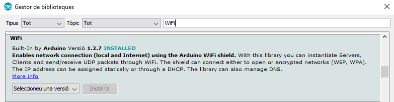

# Communications
## Wifi - Access Point

Code to enable and ESP32 to create its own WiFi network (Access Point - AP) and act as a hub (like WiFi router) for one or more stations. The maximum number of stations that can connect to it is limited to five.
	
### Code
* [access_point.ino](access_point.ino)
```cpp
#include <WiFi.h> // Includes the WiFi library

/* Put your SSID and Password */
const char *WIFI_SSID = "YOUR_SSID_NAME";  // Enter SSID here
const char *PASSWORD = "YOUR_WIFI_PASSWORD";  // Enter Password here

/* Put IP Address details */
IPAddress local_ip(192,168,1,1);
IPAddress gateway(192,168,1,1);
IPAddress subnet(255,255,255,0);

void setup() {
  Serial.begin(9600);
  
  WiFi.softAP(WIFI_SSID, PASSWORD);
  WiFi.softAPConfig(local_ip, gateway, subnet);
  Serial.println("WiFi AP is now active");
}

void loop() {
}
```

### Libraries
* Wifi library by [Arduino](https://www.arduino.cc/) - Installed from the Arduino IDE Library Management

