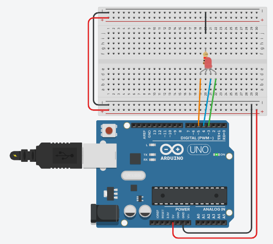

# Outputs
## LED Light - RGB
Using an RGB LED. 

[[Go back]](/outputs/led_light)

### Hardware
* ESP32
* [RGB LED](docs/RGB.jpg)
* Resistor - 330 Ohm

### [Code](RGB.ino)
```cpp
#define RED_PIN   5
#define GREEN_PIN 3
#define BLUE_PIN  4

void setup() {
  Serial.begin(9600);
  pinMode(RED_PIN, OUTPUT);  // Pinout as output
  pinMode(RED_PIN, OUTPUT);  // Pinout as output
  pinMode(RED_PIN, OUTPUT);  // Pinout as output
}

void loop() {
  setColor('red');
  delay(1000);
  setColor('green');
  delay(1000);
  setColor('white');
  delay(1000);
  setRGB(13, 227, 201);  // Mix color
  delay(1000);
  setColor('black')  // Turn off
  delay(1000);
}

/* Additional functions */
void setRGB(int R, int G, int B) {
  digitalWrite(RED_PIN, R);
  digitalWrite(GREEN_PIN, G);
  digitalWrite(BLUE_PIN, B);
}

void setColor(char color) {
  if (color == 'red') {
    setRGB(255, 0, 0);
  } else if (color == 'green') {
    setRGB(0, 255, 0);
  } else if (color == 'blue') {
    setRGB(0, 0, 255);
  } else if (color == 'white') {
    setRGB(255, 255, 255);
  } else if (color == 'black') {
    setRGB(0, 0, 0);
  }
}
```

### Libraries
* No needed libraries

### Connection

