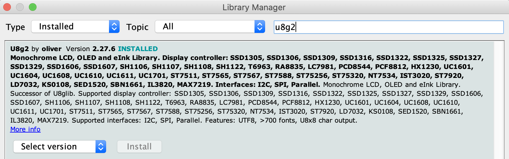

# Outputs
## OLED Screen - U8g2
Enables sending text to a standard oled screen via I2C.

[[Go back]](/outputs/oled_screen)

### Hardware
- ESP32
- OLED Screen

### [Code](U8g2.ino)
```cpp
#include <U8g2lib.h> // Library from U8g2 that enables interaction with the oled screen
#include <Wire.h> // Library for I2C communications

#define OLED_SDA 4
#define OLED_SCL 15
#define OLED_RST 16

U8G2_SSD1306_128X64_NONAME_F_HW_I2C
display(U8G2_R0, OLED_RST, OLED_SCL,
        OLED_SDA); // ESP32 Thing, HW I2C with pin remapping

void setup() {
  Serial.begin(9600); // Starts the serial communication
  Serial.println("\nBooting device...");

  pinMode(OLED_RST, OUTPUT);    // Sets GPIO pin as output
  digitalWrite(OLED_RST, LOW);  // Turn Off screen
  digitalWrite(OLED_RST, HIGH); // Turns On screen

  // Display setup
  display.begin();
  // display.setFont(u8g2_font_ncenB08_tr);  // Sets font and size
  display.setFont(u8g2_font_unifont_t_symbols);

  // Display Orientation
  display.setDisplayRotation(U8G2_R0);
  display.setFlipMode(0); // 0 or 1 depending on the desired flip orientation

  // Show some static text
  display.clearBuffer(); // Clear the internal memory
  display.drawStr(0, 10,
                  "Hello World!"); // Write something to the internal memory
  display.sendBuffer();            // Transfer internal memory to the display
}

void loop() {
  static int x;
  static int y;
  for (y = 20; y <= 64; y = y + 10) {
    for (x = 0; x <= 128; x = x + 10) {
      display.clearBuffer();
      display.drawGlyph(x, y, 9731); /* dec 9731/hex 2603 Snowman */
      display.sendBuffer();
      delay(500); // Freezes the "for" loop for 500 miliseconds
    }
    x = 0;
  }
  y = 0;
}
```

### Libraries
- [_Wire_](https://www.arduino.cc/en/reference/wire) by Arduino - Preinstalled with the Arduino IDE
  
  This library allows you to communicate with I2C / TWI devices.

- [_U8g2_](https://github.com/olikraus/u8g2) by oliver - Installed from the Arduino IDE Library Management

  

[[Go back]](/outputs/oled_screen)
