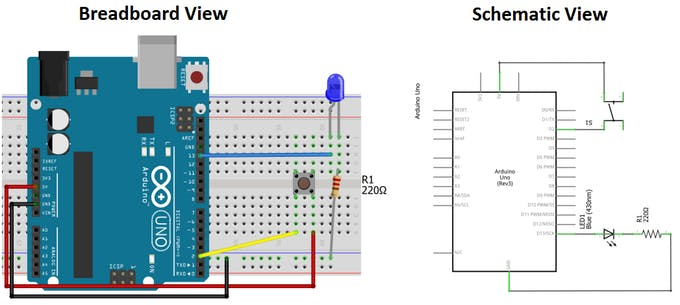

# Sensor
## Button
Using the button to control states.

[[Go back]](/sensors)

### Hardware
- ESP32
- [Button](docs/datasheet_button.pdf) - [4donline Source](https://4donline.ihs.com/images/VipMasterIC/IC/OMRN/OMRN-S-A0001309768/OMRN-S-A0001309768-1.pdf?hkey=52A5661711E402568146F3353EA87419)

### [Code](button.ino)
```cpp
#define BUTTON_PIN 2 // The number of the pushbutton pin (2-> digital pin)

void setup() {
  Serial.begin(9600); // Starts the serial communication
  Serial.println("\nBooting device...");

  pinMode(BUTTON_PIN, INPUT); // Initialize the button pin as an input
}

void loop() {
  static int buttonState; // Variable for reading the pushbutton status

  buttonState = digitalRead(BUTTON_PIN); // Read the state of the button value
  // Show the state of button on serial monitor
  if (buttonState == HIGH) {
    Serial.println("Button is pressed");
  } else {
    Serial.println("Button is not pressed");
  }
  delay(1000); // Check the button every 1000 miliseconds
}
```

### Libraries
- No needed libraries

### Connection


[[Go back]](/sensors)
