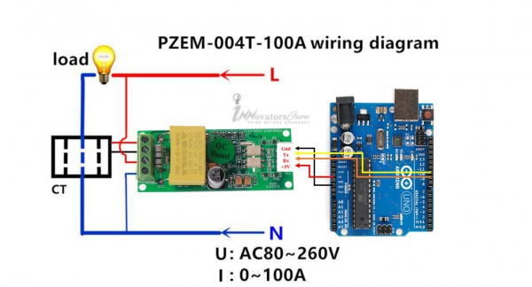

# Sensors
## Electricity Current - PZEM004T
An electronic board `PZEM004T` version 3.0 but we added libraries of version 1.0 and 3.0. You will need to buy `LM358` if you work with Arduino or `ESP32`.

[[Go back]](/sensors/electricity_current)

### Hardware
- ESP32
- [PZEM004Tv30](../docs/PZEM-004Tv30.pdf) - [Forum Arduino Source](https://forum.arduino.cc/index.php?action=dlattach;topic=480767.0;attach=220845)
- [LM358](../docs/LM358.pdf) - [TexasInstruments Source](http://www.ti.com/lit/ds/symlink/lm358-n.pdf)

### [Code](PZEM004Tv30.ino)
```cpp
#include <SoftwareSerial.h>
#include <PZEM004Tv30.h>

// Pin 17 Rx (Connects to the Tx pin on the PZEM)
// Pin 16 Tx (Connects to the Rx pin on the PZEM)

PZEM004Tv30 pzem(&Serial2, 1);

void setup() {
  Serial.begin(9600);
  Serial.println("\nBooting device...");
}

void loop() {
  delay(3000);
  float voltage = pzem.voltage();
  if (!isnan(voltage)) {
    Serial.print("Voltage: "); Serial.print(voltage); Serial.println("V");
  } else {
    Serial.println("Error reading voltage");
  }
  float current = pzem.current();
  if ( !isnan(current) ) {
    Serial.print("Current: "); Serial.print(current); Serial.println("A");
  } else {
    Serial.println("Error reading current");
  }
  float power = pzem.power();
  if ( !isnan(power) ) {
    Serial.print("Power: "); Serial.print(power); Serial.println("W");
  } else {
    Serial.println("Error reading power");
  }
  float energy = pzem.energy();
  if ( !isnan(energy) ) {
    Serial.print("Energy: "); Serial.print(energy, 3); Serial.println("kWh");
  } else {
    Serial.println("Error reading energy");
  }
  float frequency = pzem.frequency();
  if ( !isnan(frequency) ) {
    Serial.print("Frequency: "); Serial.print(frequency, 1); Serial.println("Hz");
  } else {
    Serial.println("Error reading frequency");
  }
  float pf = pzem.pf();
  if ( !isnan(pf) ) {
    Serial.print("PF: "); Serial.println(pf);
  } else {
    Serial.println("Error reading power factor");
  }
  Serial.println();
}
```

### Libraries
- [_SoftwareSerial_](https://github.com/plerup/espsoftwareserial/) by Peter Lerup and Dirk Kaar - Installed from GitHub

  

- [_PZEM-004T-V30_](https://github.com/mandulaj/PZEM-004T-v30) by mandulaj - Installed from GitHub
- [_PZEM-004T_](https://github.com/olehs/PZEM004T) by olehs - Installed from GitHub

### Connection



[[Go back]](/sensors/electricity_current)
