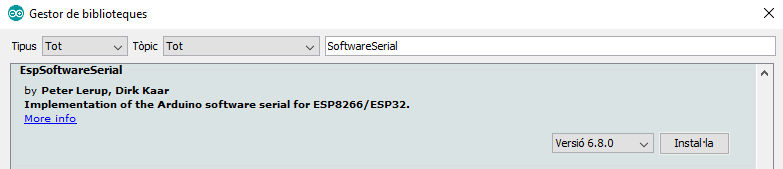
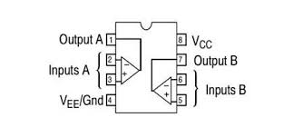
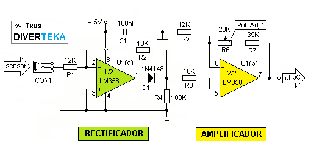

# Sensors
## Electricity Current
Using two sensor for different measurements. First is an electronic board (PZEM004T) version 3.0 but we added libraries of version 1.0 and 3.0. Second is a clamp meter (SCT-013) which can measure max. 30A, you will need to buy LM358 if you work with Arduino or ESP32.

[[Go back]](/sensors)

### Hardware
* ESP32
* [PZEM004Tv30](docs/PZEM-004Tv30.pdf) - [Forum Arduino Source](https://forum.arduino.cc/index.php?action=dlattach;topic=480767.0;attach=220845)
* [SCT-013-30](docs/SCT-013-30.pdf) - [MCIelectronic Source](https://www.mcielectronics.cl/website_MCI/static/documents/Datasheet_SCT013.pdf)
* [LM358](docs/LM358.pdf) - [TexasInstruments Source](http://www.ti.com/lit/ds/symlink/lm358-n.pdf)

### [PZEM004Tv30](PZEM004Tv30/[PZEM004Tv30.ino)
```cpp
#include <PZEM004Tv30.h>
#include <SoftwareSerial.h>
/* Use software serial for the PZEM
 * Pin 17 Rx (Connects to the Tx pin on the PZEM)
 * Pin 16 Tx (Connects to the Rx pin on the PZEM)
*/
PZEM004Tv30 pzem(&Serial2,1);

void setup() {
  Serial.begin(9600);
      
 }

void loop() {
  delay(3000);
  float voltage = pzem.voltage();
  if( !isnan(voltage) ){
    Serial.print("Voltage: "); Serial.print(voltage); Serial.println("V");
  } else {
    Serial.println("Error reading voltage");
  }
  float current = pzem.current();
  if( !isnan(current) ){
    Serial.print("Current: "); Serial.print(current); Serial.println("A");
  } else {
    Serial.println("Error reading current");
  }
  float power = pzem.power();
  if( !isnan(power) ){
    Serial.print("Power: "); Serial.print(power); Serial.println("W");
  } else {
    Serial.println("Error reading power");
  }
  float energy = pzem.energy();
  if( !isnan(energy) ){
    Serial.print("Energy: "); Serial.print(energy,3); Serial.println("kWh");
  } else {
    Serial.println("Error reading energy");
  }
  float frequency = pzem.frequency();
  if( !isnan(frequency) ){
    Serial.print("Frequency: "); Serial.print(frequency, 1); Serial.println("Hz");
  } else {
    Serial.println("Error reading frequency");
  }
  float pf = pzem.pf();
  if( !isnan(pf) ){
    Serial.print("PF: "); Serial.println(pf);
  } else {
    Serial.println("Error reading power factor");
  }
  Serial.println();    
}
```

### [SCT-013-30](SCT-013-30/SCT-013-30.ino) 
```cpp
#define SCT013 34

void setup() {
  Serial.begin(9600);

}

void loop() {
  delay(3000);
  float Tension = 225.00;
  float Irms=lectura_consum_sct013(); //Corriente eficaz (A)
  float P=Irms*Tension; // P=IV (Watts)
  Serial.print("Irms: ");
  Serial.print(Irms,3);
  Serial.print("A, Potencia: ");
  Serial.print(P,3);  
  Serial.println("W");
 
}

float lectura_consum_sct013()
{
  float voltajeSensor;
  float corriente=0;
  float Sumatoria=0;
  long tiempo=millis();
  int N=0;
  while(millis()-tiempo<500)//Duración 0.5 segundos(Aprox. 25 ciclos de 50Hz)
  { 
    voltajeSensor = (analogRead(34) * (3.3 / 4095.0))/8;////voltaje del sensor
    corriente=voltajeSensor*25.5; //corriente=VoltajeSensor*(20A/1V)
    Sumatoria=Sumatoria+sq(corriente);//Sumatoria de Cuadrados
    N=N+1;
    delay(1);
  }
  Sumatoria=Sumatoria*2;//Para compensar los cuadrados de los semiciclos negativos.
  corriente=sqrt((Sumatoria)/N); //ecuación del RMS
  return(corriente);
}
```

### Libraries
* _SoftwareSerial_ by Peter Lerup and Dirk Kaar [GitHub](https://github.com/plerup/espsoftwareserial/) - Installed from GitHub

* _PZEM-004T-V30_ by mandulaj [GitHub](https://github.com/mandulaj/PZEM-004T-v30) - Installed from GitHub

* _PZEM-004T_ by olehs [GitHub](https://github.com/olehs/PZEM004T) - Installed from GitHub


### Connection




