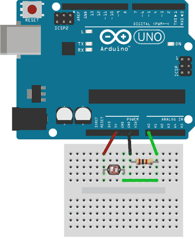

# Sensor
## Fotoresistor
Using the foto-reisitor to measure luminosity.

### Hardware
* ESP32
* [Foto-resistor](docs/datasheet_fotoresistor.pdf) - [KTH Source](https://www.kth.se/social/files/54ef17dbf27654753f437c56/GL5537.pdf)

### Code
* [fotoresistor.ino](fotoresistor.ino)
```cpp
#define DARKNESS_RES  1000  // Resistance in darkness in KΩ
#define BRIGHTNESS_RES  15  // Resistance in brightness (10 Lux) in KΩ
#define CALIBRARION_RES 10  // Calibration resistance in KΩ
#define LDR_PIN         33  // LDR Pin
 
int voltage;
int ilumination;
 
void setup(){
   Serial.begin(9600);
   analogReadResolution(12);  // Sets the reading resolution value to 12 bits (0-4095)
}
 
void loop(){
   voltage = analogRead(LDR_PIN); // Reads the value from the pin in a 0-4095 resolution corresponding to a linear 0-3.3V        
 
   ilumination = ((long)V*DARKNESS_RES*10)/((long)BRIGHTNESS_RES*CALIBRARION_RES*(4096-V));  // Use if LDR between 33 & Vcc (like in the image)  
   
   Serial.println(ilum);   
   
   delay(1000);
}
```

### Libraries
* No needed libraries

### Connection

