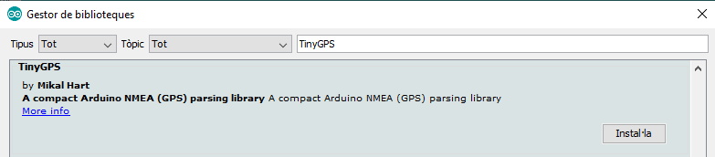

# Sensors
## GPS
There are two codes, the [simple.ino](simple/simple.ino) which is difficult undersand because this type of GPS use NMEA protocol for communicating.
For this reason we have writing a [complex.ino](complex/complex.ino) with a library to translate this protocol for better understanding.

[[Go back]](/sensors)

### Hardware
* ESP32
* [GPS](docs/gep-neo-6.pdf) - [terraelectronica Source](https://www.terraelectronica.ru/pdf/show?pdf_file=%2Fz%2FDatasheet%2FU%2FUART+GPS+NEO-6M+User+Manual.pdf)

### [Simple Cod](simple/simple.ino) (without library)
```cpp
#include <SoftwareSerial.h>
 
const int Rx = 4; //Pinout Rx of ESP32
const int Tx = 3; //Pinout Tx of ESP32
 
SoftwareSerial Serialgps(Rx,Tx);
 
void setup()
{
   Serial.begin(115200); 
   Serialgps.begin(9600); //Starts gps communication with UART
}
 
void loop()
{  // Trying read new message for one second
  for (unsigned long start = millis(); millis() - start < 1000;)
  {
   if (Serialgps.available()) //If there is a good signal
   {
      char data;
      data = Serialgps.read();
      Serial.print(data);
   }
  }
}
```

### [Complex Code](complex/complex.ino) (with library)
```cpp
#include <SoftwareSerial.h>
#include <TinyGPS.h>

const int Rx = 4; //Pinout Rx of ESP32
const int Tx = 3; //Pinout Tx of ESP32

TinyGPS gps;
SoftwareSerial Serialgps(Rx,Tx);
 
void setup(){
   Serial.begin(115200);
   Serialgps.begin(9600); //Starts gps communication with UART
}
 
void loop(){
   bool newData = false;
   unsigned long chars;
   unsigned short sentences, failed;
   
   // Trying read new message for one second
   for (unsigned long start = millis(); millis() - start < 1000;){
      while (Serialgps.available()){
         char data;
         data = Serialgps.read();
         if (gps.encode(data)) // New message received
            newData = true;
      }
   }
 
   if (newData){
      float flat, flon;
      unsigned long age;
      gps.f_get_position(&flat, &flon, &age);
      Serial.print(" LAT=");
      Serial.print(flat == TinyGPS::GPS_INVALID_F_ANGLE ? 0.0 : flat, 6);
      Serial.print(" LON=");
      Serial.print(flon == TinyGPS::GPS_INVALID_F_ANGLE ? 0.0 : flon, 6);
      Serial.print(" SAT=");
      Serial.print(gps.satellites() == TinyGPS::GPS_INVALID_SATELLITES ? 0 : gps.satellites());
      Serial.print(" PREC=");
      Serial.print(gps.hdop() == TinyGPS::GPS_INVALID_HDOP ? 0 : gps.hdop());
   }
 
   gps.stats(&chars, &sentences, &failed);
   Serial.print(" CHARS=");
   Serial.print(chars);
   Serial.print(" SENTENCES=");
   Serial.print(sentences);
   Serial.print(" CSUM ERR=");
   Serial.println(failed);
}
```

### Libraries
* _SoftwareSerial_ by Peter Lerup and Dirk Kaar [GitHub](https://github.com/plerup/espsoftwareserial/) - Installed from GitHub

* _TinyGPS_ by Mikal Hart [GitHub](https://github.com/neosarchizo/TinyGPS) - Installed from GitHub


### Connection

