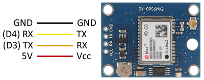

# Sensors
## GPS - Simple 
More difficult to undersand because this type of GPS use NMEA protocol for communicating.

[[Go back]](/sensors)

### Hardware
* ESP32
* [GPS](../docs/gep-neo-6.pdf) - [terraelectronica Source](https://www.terraelectronica.ru/pdf/show?pdf_file=%2Fz%2FDatasheet%2FU%2FUART+GPS+NEO-6M+User+Manual.pdf)

### [Code](simple.ino)
```cpp
#include <SoftwareSerial.h>

const int Rx = 4;  // Pinout Rx of ESP32
const int Tx = 3;  // Pinout Tx of ESP32

SoftwareSerial Serialgps(Rx, Tx);

void setup() {
  Serial.begin(9600);
  Serialgps.begin(9600);  // Starts gps communication with UART
}

void loop() {  // Trying read new message for one second
  for (unsigned long start = millis(); millis() - start < 1000;) {
    if (Serialgps.available()) { // If there is a good signal
      char data;
      data = Serialgps.read();
      Serial.print(data);
    }
  }
}
```

### Libraries
* _SoftwareSerial_ by Peter Lerup and Dirk Kaar [GitHub](https://github.com/plerup/espsoftwareserial/) - Installed from GitHub


### Connection


[[Go back]](/sensors)
