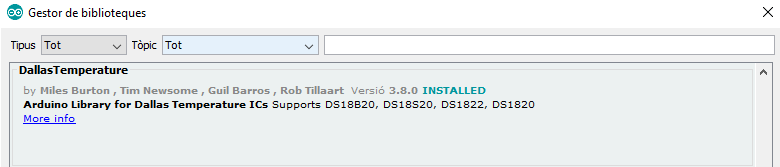
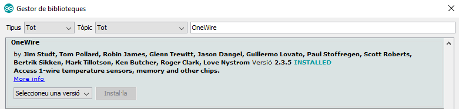
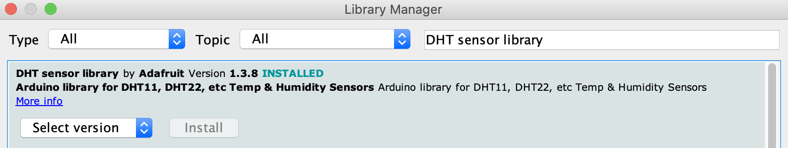

# Sensors
## Temperature (Analog)
Using the TMP36, the DS18B20 or the DHT11/DHT22 sensors we can measure the air temperature.

[[Go back]](/sensors)

### Hardware
* ESP32
* [TMP36](docs/datasheet_tmp36.pdf) - [Analog Source](https://www.analog.com/media/en/technical-documentation/data-sheets/TMP35_36_37.pdf)
* [DS18B20](docs/datasheet_ds18b20.pdf) - [SparkFun Source](https://cdn.sparkfun.com/datasheets/Sensors/Temp/DS18B20.pdf)
* [DHT11](docs/datasheet_dht11.pdf) - [DFRobot Source](https://image.dfrobot.com/image/data/KIT0003/DHT11%20datasheet.pdf)
* [DHT22](docs/datasheet_dht22.pdf) - [SparkFun Source](https://www.sparkfun.com/datasheets/Sensors/Temperature/DHT22.pdf)


### [TMP36](TMP36/TMP36.ino)
```cpp
#define TMP_PIN 32  // Number pin where the sensor is connected to

void setup() {
  Serial.begin(9600);
}

void loop() {
  int reading = analogRead(TMP_PIN);
  float temperature = analogToCelcius(reading);

  Serial.println("Temperature: " + String(temperature) + "°C");
  delay(1000);  // Waits for 1000 miliseconds
}

/* Additional functions */
float analogToCelcius(int reading) {
  float voltage = reading * 3.3;  // ESP32 reads at maximum of 3.3V
  voltage /= 4095.0;
  float temperature = voltage * 50;
  return temperature;
}

```

### [DS18B20](DS18B20/DS18B20.ino)
```cpp
#include <DallasTemperature.h>  // Includes the Dallas Temperature library
#include <OneWire.h>  // Includes the One Wire library

#define DS18B20_PIN 5  // Number pin where the sensor is connected to

OneWire oneWire(DS18B20_PIN);
DallasTemperature sensors(&oneWire);

void setup() {
  Serial.begin(9600);
  sensors.begin();
}

void loop() {
  sensors.requestTemperatures();
  float tempCelcius = sensors.getTempCByIndex(0);  // Reads temp in Celcius
  float tempFarenheit = sensors.getTempFByIndex(0);  // Reads temp in Farenheit

  if (isnan(tempCelcius) || isnan(tempFarenheit)) {  // Check if there is any reading error
    Serial.println("Error reading Sensor DS18B20");
  } else {
    Serial.println("Temperature: " + String(tempCelcius) + "°C - " + String(tempFarenheit) + "°F");
  }
  delay(1000);  // Waits for 1000 miliseconds
}
```

### [DHT](DHT.ino)
```cpp
#include "DHT.h"  // Include DHT library

#define DHT_PIN  21     // Defines pin number to which the sensor is connected 
#define DHT_TYPE DHT22  // Defines the sensor type. It can be DHT11 or DHT22

DHT dht(DHT_PIN, DHT_TYPE);  // Defines the sensor dht

float temperature;  // Variable that will store the last temperature value

void setup(){
  Serial.begin(9600);  // Starts the serial communication

  Serial.println("Starting sensor...");
  dht.begin();  // Starts sensor communication
}

void loop(){
  tempreature = dht.readTemperature();  // Reads the temperature, it takes about 250 milliseconds
  
  Serial.println("Temperature: " + String(temperature) + "°C");  // Prints in a new line the result
  
  delay(1000);  // Freezes the loop for 1000 milliseconds
}
```


### Libraries
* _DS18B26 sensor library_ by Miles Burton [GitHub](https://github.com/milesburton/Arduino-Temperature-Control-Library) - Installed from the Arduino IDE Library Management

* _OneWire library_ by PaulStoffregen [Github](https://github.com/PaulStoffregen/OneWire) - Installed from the Arduino IDe Library Management

* _DHT sensor library_ by Adafruit [GitHub](https://github.com/adafruit/DHT-sensor-library) - Installed from the Arduino IDE Library Management


### Connection 
