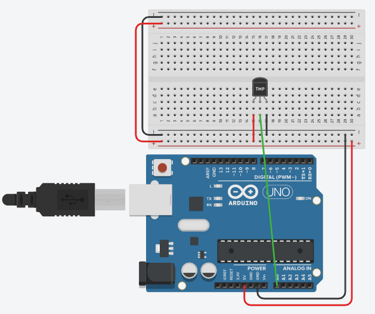

# Sensors
## Temperature - TMP36
Using the TMP36 analog sensor we can measure the air temperature.

[[Go back]](/sensors/temperature)

### Hardware
- ESP32
- [TMP36](../docs/datasheet_tmp36.pdf) - [Analog Source](https://www.analog.com/media/en/technical-documentation/data-sheets/TMP35_36_37.pdf)

### [TMP36](TMP36.ino)
```cpp
#define TMP_PIN 32  // Number pin where the sensor is connected to

void setup() {
  Serial.begin(9600);
  Serial.println("\nBooting device...");
}

void loop() {
  static float temperature;
  int reading = analogRead(TMP_PIN);
  temperature = analogToCelcius(reading);

  Serial.println("Temperature: " + String(temperature) + "°C");
  delay(1000);  // Waits for 1000 miliseconds
}

/* Additional functions */
float analogToCelcius(int reading) {
  float voltage = reading * 3.3;  // ESP32 reads at maximum of 3.3V
  voltage /= 4095.0;
  float temperature = voltage * 50;
  return temperature;
}
```

### Libraries
- No needed libraries

### Connection 
