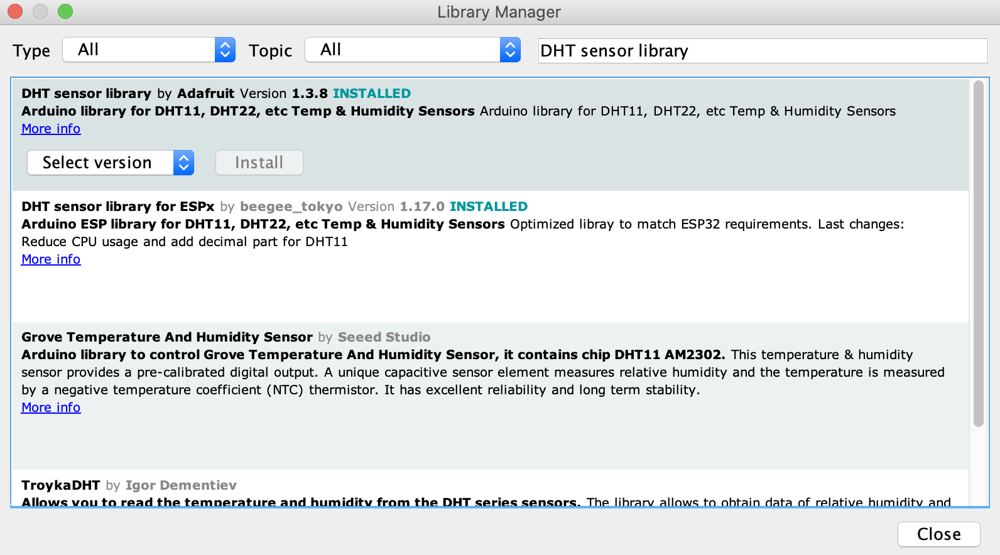

# Sensors
## Temperature (Digital)

Using the DHT11 or the DHT22 we can measure the air temperature using the following example.

### Hardware
* ESP32
* DHT11 - [Datasheet](docs/datasheet_dht11.pdf) - [Source DFRobot](https://image.dfrobot.com/image/data/KIT0003/DHT11%20datasheet.pdf)
* DHT22 - [Datasheet](docs/datasheet_dht22.pdf) - [Source SparkFun](https://www.sparkfun.com/datasheets/Sensors/Temperature/DHT22.pdf)

### Code
* [temperature_digital.ino](temperature_digital.ino)
```cpp
#include "DHT.h"  // Includes the DHT library

#define DHT_PIN 21  // Defines pin number to which the sensor is connected 
#define DHT_TYPE DHT22  // Defines the sensor type. It can be DHT11 or DHT22
#define REFRESH_RATE  2 // Defined in seconds

DHT dht(DHT_PIN, DHT_TYPE);  // Defines the sensor
float t;  // Variable that will store the last temperature value

void setup(){
  Serial.begin(9600);

  Serial.println("Starting sensor...");
  dht.begin();  // Starts sensor communication
}

void loop(){
  t = dht.readTemperature();  // Reads the temperature, it takes about 250 milliseconds
  
  Serial.println("Temperature: " + String(t) + "°C");  // Prints in a new line the result
  delay(REFRESH_RATE*1000);  // Freezes the loop for X milliseconds
}
```

### Libraries
* DHT sensor library by Adafruit - Installed from Arduino IDE Library management
